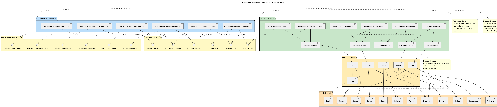

# Modelo de Arquitetura do Sistema de Gestão de Hotéis

## 1. Visão Geral

O sistema de gestão de hotéis foi desenvolvido utilizando uma **arquitetura em camadas** (layered architecture), que promove a separação de responsabilidades, facilita a manutenção e permite a evolução independente de cada camada.

A arquitetura é composta por **quatro módulos principais**:

1. **Módulo de Domínios**
2. **Módulo de Entidades**
3. **Módulo de Serviço** (Camada de Serviço)
4. **Módulo de Apresentação** (Camada de Apresentação)

## 2. Diagrama Integrante da Arquitetura

## 3. Descrição dos Módulos

### 3.1 Módulo de Domínios

**Responsabilidade**: Representar e validar tipos de dados do domínio do problema.

**Descrição**: Este módulo contém classes que encapsulam os tipos de dados básicos do sistema, garantindo que apenas valores válidos sejam armazenados. Cada classe de domínio implementa validações específicas conforme os requisitos do sistema.

**Classes**:
- **Capacidade**: Valida capacidade de quarto (1, 2, 3 ou 4 pessoas)
- **Cartao**: Valida número de cartão de crédito (16 dígitos com algoritmo de Luhn)
- **Codigo**: Valida código alfanumérico (10 caracteres: a-z, 0-9)
- **Data**: Valida data no formato DD-MMM-AAAA com verificação de anos bissextos
- **Dinheiro**: Valida valores monetários (0,01 a 1.000.000,00, armazenado em centavos)
- **Email**: Valida endereço de email (parte-local@domínio)
- **Endereco**: Valida endereço (5 a 30 caracteres)
- **Nome**: Valida nome de pessoa (5 a 20 caracteres, primeiro caractere maiúsculo)
- **Numero**: Valida número de quarto (001 a 999)
- **Ramal**: Valida ramal telefônico (00 a 50)
- **Senha**: Valida senha (5 caracteres com regras específicas)
- **Telefone**: Valida número de telefone (+DDDDDDDDDDDDDD)

**Interface Pública**: Cada classe expõe métodos `set(valor)` para definir o valor (com validação) e `get()` para obter o valor armazenado. Métodos `set` lançam exceção `invalid_argument` em caso de formato inválido.

---

### 3.2 Módulo de Entidades

**Responsabilidade**: Representar as entidades do modelo de negócio do sistema.

**Descrição**: Este módulo contém classes que representam os conceitos principais do domínio de gestão de hotéis. Cada entidade é composta por atributos que são instâncias de classes de domínio, garantindo a integridade dos dados.

**Classes**:
- **Pessoa**: Classe base com nome e email
- **Gerente**: Herda de Pessoa, adiciona senha (para autenticação)
- **Hotel**: Representa um hotel (nome, endereço, telefone, código, email do gerente)
- **Quarto**: Representa um quarto (número, capacidade, diária, ramal, código do hotel)
- **Reserva**: Representa uma reserva (chegada, partida, valor, código, número do quarto, código do hotel)
- **Hospede**: Representa um hóspede (endereço, cartão, código da reserva)

**Interface Pública**: Cada classe expõe métodos `set` e `get` para seus atributos, que são objetos de classes de domínio.

**Relacionamentos**:
- Gerente herda de Pessoa
- Hotel está associado a Gerente (via email)
- Quarto está associado a Hotel (via código)
- Reserva está associada a Quarto (via número e código do hotel)
- Hospede está associado a Reserva (via código)

---

### 3.3 Módulo de Serviço (Camada de Serviço)

**Responsabilidade**: Implementar a lógica de negócio, gerenciar o armazenamento de dados e garantir a integridade referencial.

**Descrição**: Este módulo é responsável por executar as operações de negócio do sistema, validar regras de integridade e persistir dados em memória. É composto por **controladoras de serviço** e **contêineres de dados**.

#### 3.3.1 Contêineres

Os contêineres são responsáveis pelo armazenamento de dados em memória utilizando estruturas STL (`vector`).

**Classes**:
- **ContainerGerentes**: Armazena gerentes (chave: email)
- **ContainerHoteis**: Armazena hotéis (chave: código)
- **ContainerQuartos**: Armazena quartos (chave: número + código do hotel)
- **ContainerReservas**: Armazena reservas (chave: código)
- **ContainerHospedes**: Armazena hóspedes (chave: cartão)

**Operações**: Cada contêiner oferece métodos para adicionar, buscar, atualizar, remover e listar entidades.

#### 3.3.2 Controladoras de Serviço

As controladoras implementam as interfaces de serviço e coordenam as operações de negócio.

**Classes**:
- **ControladoraServicoAutenticacao**: Gerencia autenticação e criação de contas
- **ControladoraServicoGerente**: Gerencia operações CRUD de gerentes
- **ControladoraServicoHotel**: Gerencia operações CRUD de hotéis (valida exclusão com quartos)
- **ControladoraServicoQuarto**: Gerencia operações CRUD de quartos (valida exclusão com reservas)
- **ControladoraServicoReserva**: Gerencia operações CRUD de reservas (valida conflitos de datas e exclusão com hóspedes)
- **ControladoraServicoHospede**: Gerencia operações CRUD de hóspedes

**Regras de Integridade Implementadas**:
- Não permitir exclusão de hotel com quartos associados
- Não permitir exclusão de quarto com reservas ativas
- Não permitir exclusão de reserva com hóspedes associados
- Não permitir sobreposição de datas em reservas do mesmo quarto
- Não permitir duplicação de chaves primárias (email, código, cartão)

---

### 3.4 Módulo de Apresentação (Camada de Apresentação)

**Responsabilidade**: Gerenciar a interface com o usuário, validar entrada de dados e controlar o fluxo de navegação.

**Descrição**: Este módulo é responsável pela interação com o usuário através de interface de console (cin/cout). Captura entradas, valida formatos, exibe mensagens e coordena a navegação entre telas.

**Classes Controladoras**:
- **ControladoraApresentacaoAutenticacao**: Telas de login e criação de conta
- **ControladoraApresentacaoGerente**: Menu de gerenciamento de perfil
- **ControladoraApresentacaoHotel**: Menu CRUD de hotéis
- **ControladoraApresentacaoQuarto**: Menu CRUD de quartos
- **ControladoraApresentacaoReserva**: Menu CRUD de reservas
- **ControladoraApresentacaoHospede**: Menu CRUD de hóspedes

**Funcionalidades**:
- Exibição de menus e opções
- Captura e validação de entrada do usuário
- Criação de objetos de domínio e entidade
- Invocação de serviços da camada de serviço
- Tratamento de exceções e exibição de mensagens de erro
- Controle de fluxo entre telas

---

## 4. Interfaces entre Módulos

A comunicação entre os módulos é realizada através de **interfaces abstratas** (classes abstratas em C++), que definem contratos claros e promovem o baixo acoplamento.

### 4.1 Interfaces de Serviço

Declaradas no arquivo `interfaces.h`, definem os serviços disponibilizados pela camada de serviço:

- **IServicoAutenticacao**: Autenticação e criação de contas
- **IServicoGerente**: Operações CRUD de gerentes
- **IServicoHotel**: Operações CRUD de hotéis
- **IServicoQuarto**: Operações CRUD de quartos
- **IServicoReserva**: Operações CRUD de reservas e validação de conflitos
- **IServicoHospede**: Operações CRUD de hóspedes

### 4.2 Interfaces de Apresentação

Declaradas no arquivo `interfaces.h`, definem os pontos de entrada da camada de apresentação:

- **IApresentacaoAutenticacao**: Fluxo de autenticação
- **IApresentacaoGerente**: Menu de gerenciamento de perfil
- **IApresentacaoHotel**: Menu de gerenciamento de hotéis
- **IApresentacaoQuarto**: Menu de gerenciamento de quartos
- **IApresentacaoReserva**: Menu de gerenciamento de reservas
- **IApresentacaoHospede**: Menu de gerenciamento de hóspedes

---

## 5. Fluxo de Dados

O fluxo de dados no sistema segue a arquitetura em camadas:

1. **Usuário** interage com a **Camada de Apresentação** (cin/cout)
2. **Camada de Apresentação** valida entrada e cria objetos de **Domínio** e **Entidade**
3. **Camada de Apresentação** invoca serviços através das **Interfaces de Serviço**
4. **Camada de Serviço** executa lógica de negócio e valida regras de integridade
5. **Camada de Serviço** acessa **Contêineres** para persistir/recuperar dados
6. **Contêineres** armazenam **Entidades** em memória (vector)
7. **Entidades** são compostas por **Domínios** validados
8. Resultado retorna pela cadeia até a **Camada de Apresentação**
9. **Camada de Apresentação** exibe resultado ao **Usuário**

---

## 6. Tratamento de Exceções

O sistema utiliza exceções da biblioteca padrão C++ (`invalid_argument`) para sinalizar erros de validação:

- **Classes de Domínio**: Lançam `invalid_argument` quando o método `set` recebe valor inválido
- **Camada de Apresentação**: Captura exceções e exibe mensagens de erro ao usuário
- **Camada de Serviço**: Retorna valores booleanos para indicar sucesso/falha de operações

---

## 7. Decisões de Projeto

### 7.1 Armazenamento em Memória

Optou-se por armazenar dados em memória utilizando `vector` da STL por simplicidade e adequação ao escopo do projeto. Para persistência em banco de dados, seria necessário substituir os contêineres por implementações que utilizam SQLite.

### 7.2 Validação em Domínios

A validação de dados é centralizada nas classes de domínio, garantindo que valores inválidos nunca sejam armazenados no sistema. Isso promove a integridade dos dados e facilita a manutenção.

### 7.3 Interfaces Abstratas

O uso de interfaces abstratas entre as camadas permite:
- Baixo acoplamento entre módulos
- Facilidade para testes unitários (mock objects)
- Flexibilidade para trocar implementações
- Conformidade com princípios SOLID (Dependency Inversion)

### 7.4 Separação de Responsabilidades

Cada módulo tem responsabilidades bem definidas:
- **Domínios**: Validação de tipos
- **Entidades**: Representação de conceitos
- **Serviço**: Lógica de negócio
- **Apresentação**: Interface com usuário

---

## 8. Extensibilidade

A arquitetura permite extensões futuras:

- **Persistência em Banco de Dados**: Substituir contêineres por implementações com SQLite
- **Interface Gráfica**: Criar novas controladoras de apresentação com GUI (Qt, wxWidgets)
- **API REST**: Adicionar camada de API sobre a camada de serviço
- **Novos Módulos**: Adicionar módulos de relatórios, estatísticas, etc.
- **Autenticação Avançada**: Implementar tokens, sessões, etc.

---

## 9. Conformidade com Requisitos

A arquitetura atende todos os requisitos não funcionais especificados:

✅ Estilo em camadas (layers)  
✅ Composição por camada de apresentação e camada de serviço  
✅ Camada de apresentação responsável por interface e validação  
✅ Camada de serviço responsável por lógica de negócio e armazenamento  
✅ Decomposição em módulos de software (4 módulos)  
✅ Módulos interagem via interfaces especificadas  
✅ Módulos decompostos em classes  
✅ Classes representam domínios, entidades, controladoras e contêineres  
✅ Implementação em C++  
✅ Compatível com Code::Blocks  

---

## 10. Conclusão

A arquitetura do sistema de gestão de hotéis foi projetada para ser modular, extensível e de fácil manutenção. A separação clara de responsabilidades entre os módulos, o uso de interfaces abstratas e a validação rigorosa de dados garantem a qualidade e robustez do sistema.
